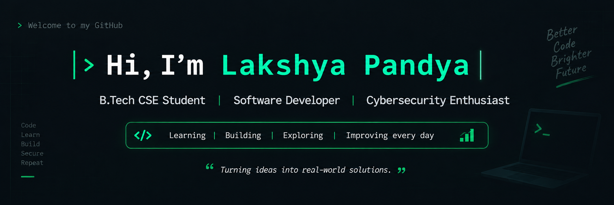

 

### B.Tech CSE Student &nbsp;•&nbsp; Software Development &nbsp;•&nbsp; Cybersecurity

---

## 🧑‍💻 About Me

I'm a **B.Tech Computer Science student** interested in
**Software Development, Cybersecurity, Linux, Networking and Digital Forensics**.

I enjoy building practical projects, exploring new technologies,
and improving my programming and problem-solving skills through
hands-on development.

My goal is to continuously learn, build meaningful projects,
and grow as a well-rounded technology professional.

---

## ⚡ Tech Stack

### 💻 Programming Languages

### 🧰 Tools & Technologies

### 🔐 Security & Systems

`Cybersecurity` &nbsp; `Digital Forensics` &nbsp; `Networking` &nbsp;
`Cryptography` &nbsp; `Linux` &nbsp; `Incident Response`

---

## 🚀 What I'm Working On

| Area | Focus |
|---|---|
| 💻 Development | Building practical applications |
| 🔐 Cybersecurity | Exploring security concepts |
| 🐧 Linux | Strengthening system fundamentals |
| 🌐 Networking | Learning networks & protocols |
| 🗄️ Databases | Working with SQL |
| 🧠 Problem Solving | Improving programming skills |

---

## 📂 Featured Projects

### 🎓 Student Management System

Java-based application for managing student information and records.

**Tech:** `Java`

### 💰 Student Expense Management System

Application for managing and tracking student expenses.

**Tech:** `Java` • `Database`

### 🔐 Cybersecurity Projects

Hands-on projects exploring cybersecurity, system security,
digital forensics and security workflows.

**Tech:** `Python` • `Linux` • `Cybersecurity`

---

## 📊 GitHub Analytics

---

## 🔥 Contribution Streak

---

## 🎯 Current Goals

- [x] Learn programming fundamentals
- [x] Build practical projects
- [→] Improve Java & Python
- [→] Strengthen Linux & Networking
- [→] Explore Cybersecurity
- [→] Build stronger real-world projects
- [ ] Contribute to Open Source
- [ ] Build impactful applications

---

## 🌐 Let's Connect

---

### `> Keep learning. Keep building. Keep improving._`

